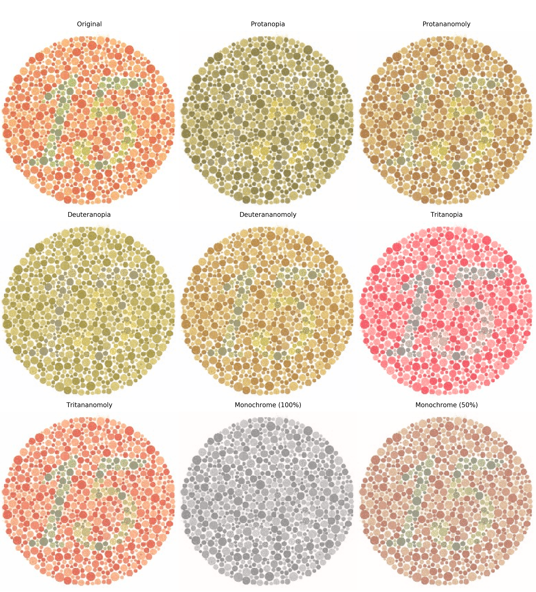
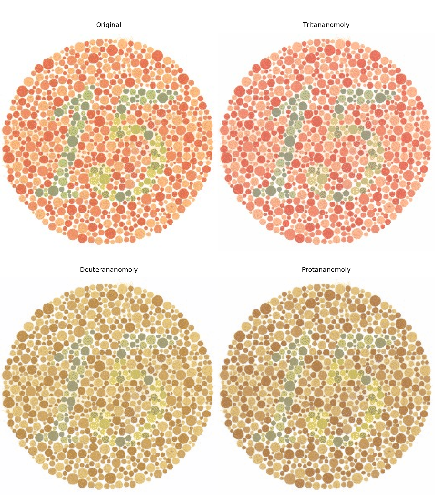
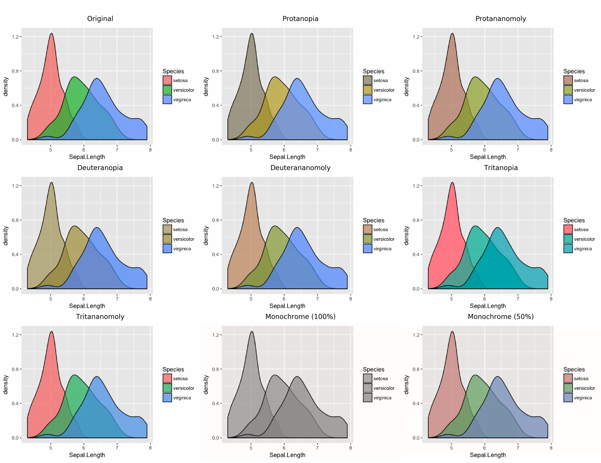

# CBviz

This is a small script that leverages Nathaniel Smith's
[`colorspacious`][colorspacious] library to check for or simulate colorblindess
given an input image.

## Color vision deficiencies

Colorblindness or color vision deficiency (CVD) affects roughly 8% of men and
0.05% of women.  Almost all vertebrates express a type photoreceptor called rhodopsin
(rods) in the retina which is responsible for our baseline and low-light
vision.  In addition to rod cells, humans (unlike many mammals) are trichromats
meaning that there are 3 additional photosensitive receptors (called opsins)
grant us our colorvision[1][1]; these are cone cells and each type of cone
responds most strongly to a different portion of the light spectrum.  The L-cone
(or long-wave cone, OPN1LW) gives us red perception, the M-cone (or medium-wave
cone, OPN1MW) gives us green perception, and the S-cone (or short-wave cone,
OPN1SW) gives us blue perception.

The major forms of color vision deficiency stem from problems with individual
cone types, resulting in 3 types of dichromatism:
-   protanopia (protanomoly): problematic L-cone
-   deuteranopia (deuteranomoly): problematic M-cone
-   tritanopia (tritanomoly): problematic S-cone

These problems can be genetic or trauma related and their severity can range
from mild (\*-anomolous) to complete absence (\*-opia).  Problems with red or
green cones is substantially more common than problems with the blue cone. This
is a consequence of the fact that our green cone is actually a genetic duplicate
of our red cone that happened sometime within the last 80 million years[2][2]!
Because of this gene duplication, both the red and green opsin genes are encoded
on the X chromosome (whereas blue is encoded on chromosome 6).  Thus mutations
on the X chromosome may interfer with the normal expression of the opsin
proteins, leading to color deficient vision.  Because men only have one copy of
the X chromosome, a defective X chromosome necessarily leads to colorblindness
whereas women can be carriers of colorblindness assuming they have not inherited
two defective X chromosomes[3][3].

Blue CVD ("tritan"s) is substantially rarer because the gene is encoded on
chromosome 6. That said, it can (and so can red and green CVD) occur due to
trauma, aging, some diseases, or drugs. For example, through diabetes, shaken
baby syndrome, macular degeneration, and the TB drug ethambutol.

[1]: Note that there are many opsins in the retina of which more than 4 are
  involved in light sensing and vision.
[2]: True green opsins that can be found in birds, for example, have maximal
  sensitivity near 500nm with red cone sensitivity maximal at 560nm.  Us humans
  have green and red maximal sensitivity around 530nm and 560nm respectively.
[3]: Some women are carriers of colorblindness can actually be tetrachromats.
  In female mammals, one X chromosome is always inactivated in each cell, but
  this X-inactivation is random, resulting in both the normal and defective X
  chromosomes being expressed in different retinal cells.  In rare cases, the
  defect opsin may be sensitive to other areas of the visual spectrum not
  covered by the traditional red, green, and blue opsins, meaning these females
  can effectively have 4 different active color photoreceptors.

## Installation

Currently, this needs to be installed manually:

    git clone https://github.com/wflynny/cbviz.git
    cd cbviz
    python setup.py install

then run

    cbviz simulate --help
    cbviz-fast --help

## Functionality

There are two main functions supplied, `test` and `simulate`.

### Simulate

Alternatively, `simulate` transforms the input image from a simulated colorvision
deficient sRGB space to the sRGB space, simulating how someone will colorvision
deficiency would perceive the image.

	usage: cbviz simulate [-h] [-s SEVERITY] (-t TYPE | -a) [--individual-plots]
						  [--no-original]
						  infile outfile

	positional arguments:
	  infile                Input image path
	  outfile               Path to save resulting image(s)

	optional arguments:
	  -h, --help            show this help message and exit
	  -s SEVERITY, --severity SEVERITY
							[0-100]: severity of colorblindess, 0 being no
							deficiency, 100 being completely *opic
	  -t TYPE, --type TYPE  One or more of 'protan*', 'deuteran*', 'tritan*',
							'mono*' in **comma** separated list.
	  -a, --all             Include completely *opic versions as well as anomalous
							versions with given severity.If severity is 100, then
							show anomalous versions at severity=50 too.
	  --individual-plots    Store each image as separate file
	  --no-original         Don't show original for comparison

The parameters that control what type of CVD is plotted are the following:

    -a, --all
    -t, --type 'protan,deuteran,tritan,monochrome' ['p,d,t,m']
    -s, --severity [0-100, default=100]

Note that `--all` and `--type` are mutually exclusive.  If `--all` is specified,
simulate all types of color deficient vision at two severity levels.  If a
specific `--severity S` is specified, then it will plot everything with severity
= `S` and 100. Otherwise, it will plot things with severity = 50 and 100.

When invoking the `--individual-plots` command, note that the plots will be
saved with prefixes `outfile.{cvd-type}.png`.

#### Examples

    cbviz simulate -a test/demo4.png test/demo4.cb.png

    cbviz simulate -t protan,deuteran,tritan -s 50 test/demo4.png test/demo4.cb50.png

    cbviz simulate -a test/colorblindr.fig1.png test/colorblindr.fig1.cb.png

For the last image, see Claus Wilke's [colorblindr][colorblindr] R package,
which allows one to simulate color deficient vision within ggplot2 before
saving the output.

### Test

In theory, `test` will attempt to check whether a supplied input image is
'colorblind-friendly' and provide text-based output telling the user a.) the
image is indeed colorblind-friendly or b.) which types of colorblindness for
which the image is poorly suited.

However, this curerntly doesn't work.  I've tried implementing two algorithms,
but both have downsides.  One way I've tried is to compare the original image
and the colorblind images all in the CAM02-UCS colorspace (meaning they go from
sRGB+CVD to sRGB to JCh) and comparing the J/h channels.  Images are judged
whether each pair of pixels (original and CVD) are close enough under some
relative threshold (controlled by the parameter `-e, --epsilon Threshold`).

### `cbviz-fast`

This script just assumes some default options and makes it very easy to make a
2x2 grid consisting of the original and the 3 CVD types.

## Theory behind the computations
See the documentation of [colorspacious][colorspacious].

[colorspacious]: http://colorspacious.readthedocs.io/en/latest/tutorial.html
[colorblindr]: https://github.com/clauswilke/colorblindr
